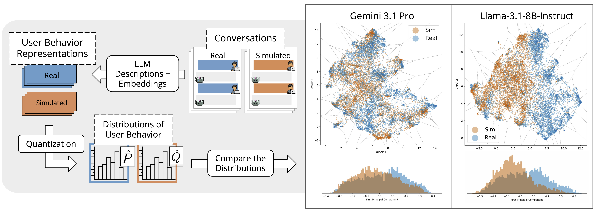

<div align="center">

# Measuring and Mitigating the Distributional Gap Between Real and Simulated User Behaviors

[](https://arxiv.org/abs/2605.07847)
[](https://huggingface.co/datasets/shuhaibmehri/UserBehavioralDivergence-simulated-conversations)
[](LICENSE)

</div>


This repository contains the code and data for **Measuring and Mitigating the Distributional Gap Between Real and Simulated User Behaviors**. In this work, we evaluate how well user simulators capture the broad, heterogeneous behavior of real users by comparing the distributions of user behaviors demonstrated in real and simulated conversations.


<div align="center">
  
</div>

Our method extracts representations of user behavior from real and simulated conversations, then quantizes them via k-means to get discrete behavioral distributions. This figure presents UMAP projections and first principal component histograms for Gemini 3.1 Pro and Llama-3.1-8B-Instruct on the coding task. We can see that Gemini 3.1 Pro overlaps real users more closely compared to Llama-3.1-8B-Instruct.


---

## Data

The simulated conversation data used in our experiments is available on HuggingFace: [shuhaibmehri/UserBehavioralDivergence-simulated-conversations](https://huggingface.co/datasets/shuhaibmehri/UserBehavioralDivergence-simulated-conversations).

Each JSONL file contains conversations for a specific user simulator model on either the coding or writing task. Every record has the following fields:

| Field | Description |
|-------|-------------|
| `id` | Unique conversation identifier (shared across real and simulated) |
| `real_messages` | The original conversation from WildChat |
| `simulated_messages` | The corresponding simulated conversation |

The dataset covers 25 user simulator models (7 closed-source, 16 open-source, 2 trained simulators) with 5,000 conversations each for coding and writing tasks.

---

## 🚀 Quick Start

1. Clone the repository:
```bash
git clone https://github.com/Shuhaibm/UserBehavioralDivergence.git
cd UserBehavioralDivergence
```

2. Create virtual environment:
```bash
python3 -m venv env
source env/bin/activate
```

3. Install dependencies:
```bash
pip install -r requirements.txt
```

---

## Method

Our method consists of three stages. See `run.sh` for the complete script.

### 1. Generate User Behavior Descriptions

For each conversation (real and simulated), an LLM generates descriptions of the user's behavior along six facets: Requests, Responses, Context, Communication Style, DAMSL Dialog Acts, and SGD Dialog Acts. These are then combined into a single representation per conversation.

First, launch a vLLM chat server:
```bash
vllm serve Qwen/Qwen3.5-122B-A10B-FP8 \
    --tensor-parallel-size 4 \
    --max-model-len 32768 \
    --reasoning-parser qwen3 \
    --enable-prefix-caching \
    --gpu-memory-utilization 0.80 \
    --port 8000 \
    --max-num-seqs 64 \
    --enable-chunked-prefill
```

Then generate the descriptions:
```bash
SIMULATOR_NAME="simulator-name"
CONV_FILE="/path/to/conversations.jsonl"
OUTPUT_DIR="./results/coding"

for FACET in raw_conversation raw_user_utterances raw_intent; do
    python3 generate_descriptions.py \
        --facet ${FACET} \
        --input_file "${CONV_FILE}" \
        --simulator_name ${SIMULATOR_NAME} \
        --output_dir ${OUTPUT_DIR}
done

for FACET in requests_facet responses_facet context_facet communication_style_facet DAMSL_facet SGD_facet; do
    python3 generate_descriptions.py \
        --facet ${FACET} \
        --input_file "${CONV_FILE}" \
        --simulator_name ${SIMULATOR_NAME} \
        --model_name Qwen/Qwen3.5-122B-A10B-FP8 \
        --api_base http://localhost:8000/v1 \
        --api_key EMPTY \
        --output_dir ${OUTPUT_DIR}
done

python3 generate_descriptions.py \
    --facet combined \
    --input_file "${CONV_FILE}" \
    --simulator_name ${SIMULATOR_NAME} \
    --model_name Qwen/Qwen3.5-122B-A10B-FP8 \
    --api_base http://localhost:8000/v1 \
    --output_dir ${OUTPUT_DIR}
```

| Argument | Description |
|----------|-------------|
| `--facet` | Builtin: `raw_conversation`, `raw_user_utterances`, `raw_intent`. LLM: `requests_facet`, `responses_facet`, `context_facet`, `communication_style_facet`, `DAMSL_facet`, `SGD_facet`. Or `combined` |
| `--input_file` | Input JSONL conversation file |
| `--simulator_name` | Name of the simulator (used as output subdirectory) |
| `--output_dir` | Output directory (e.g., `./results/coding`) |
| `--model_name` | Chat model for LLM-based facets |
| `--api_base` | vLLM server URL |
| `--max_pending` | Max concurrent requests (default: 4096) |

### 2. Embed Representations

Behavioral descriptions are embedded into a shared semantic space using a text embedding model via vLLM.

```bash
python3 embed.py \
    --model_name Qwen/Qwen3-Embedding-8B \
    --representations_dir ./results/coding \
    --tensor_parallel_size 4 \
    --chunk_size 1000
```

| Argument | Description |
|----------|-------------|
| `--model_name` | Embedding model name |
| `--representations_dir` | Directory with generated descriptions |
| `--tensor_parallel_size` | Number of GPUs for tensor parallelism |
| `--chunk_size` | Batch size for embedding (default: 1000) |

### 3. Evaluate Divergence

Embeddings are quantized via k-means into discrete behavioral distributions, and the gap between real and simulated distributions is measured using Forward KL, Backward KL, and Jensen-Shannon divergence. UMAP scatter plots and PC1 histograms are generated for visualization.

```bash
python3 evaluate.py \
    --representations_dir ./results/coding \
    --embed_dim 1024 \
    --k 500
```

| Argument | Description |
|----------|-------------|
| `--representations_dir` | Directory with embedding files |
| `--embed_dim` | Embedding dimension after MRL truncation (default: 1024) |
| `--k` | Number of k-means clusters (default: 500) |
| `--summary_file` | Optional path for aggregated results JSON |

---

## Citation

If you use this code in your research, please cite:

```bibtex
@misc{mehri2026measuringmitigatingdistributionalgap,
      title={Measuring and Mitigating the Distributional Gap Between Real and Simulated User Behaviors},
      author={Shuhaib Mehri and Philippe Laban and Sumuk Shashidhar and Marwa Abdulhai and Sergey Levine and Michel Galley and Dilek Hakkani-Tür},
      year={2026},
      eprint={2605.07847},
      archivePrefix={arXiv},
      primaryClass={cs.CL},
      url={https://arxiv.org/abs/2605.07847},
}
```
